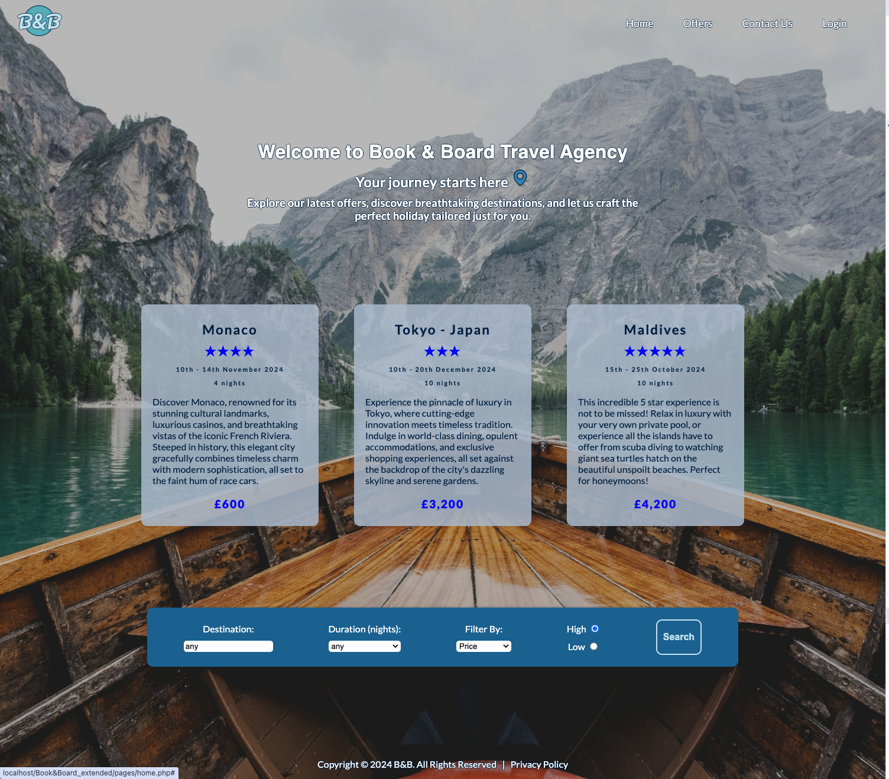
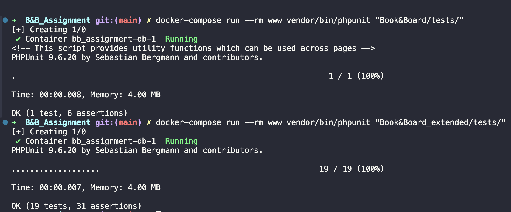

# Book-Board_Travel

## To run the project:

- Ensure Docker is installed and running on your device
- In the route directory, run:

```
docker-compose up --build
```

The containers are now built and running, with the project live.

- To stop the project, in the route directory run:

```
docker-compose down
```

## Viewing the project

To view Phase 1, type the following URL into your browser:

http://localhost/Book&Board

To view Phase 2 (Web App with users and search), type the following URL into your browser:

http://localhost/Book&Board_extended



## Testing

Both phase 1 and phase 2 have automated unit testing using PHPUnit.

To run the tests:

- Ensure the Docker containers have been started (see project run instructions)
- For phase 1 testing, in your terminal type the following:

```
docker-compose run --rm www vendor/bin/phpunit "Book&Board/tests/"
```

- For phase 2 testing, in your terminal type the following:

```
docker-compose run --rm www vendor/bin/phpunit "Book&Board_extended/tests/"
```



The project also contains Selenium IDE test files, which can be run using the Selenium IDE browser extension. These tests provide automated end to end and integration testing for the project.
